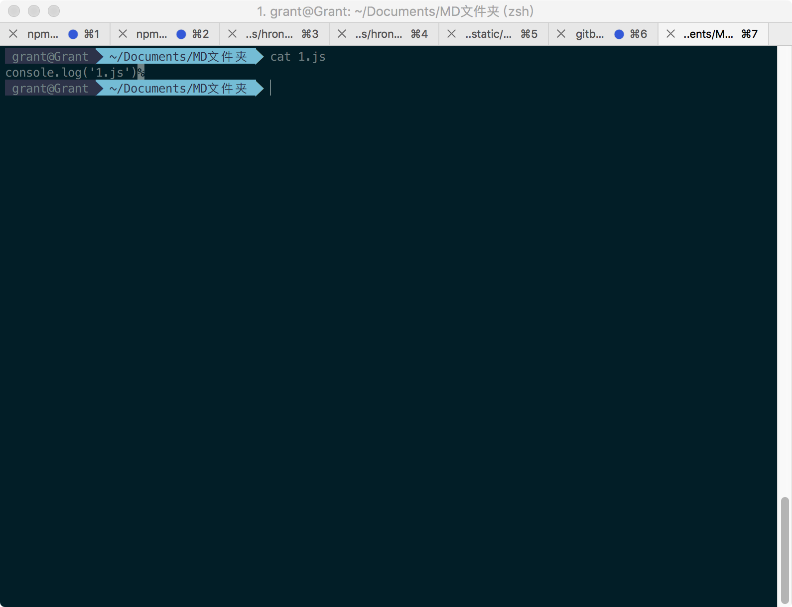
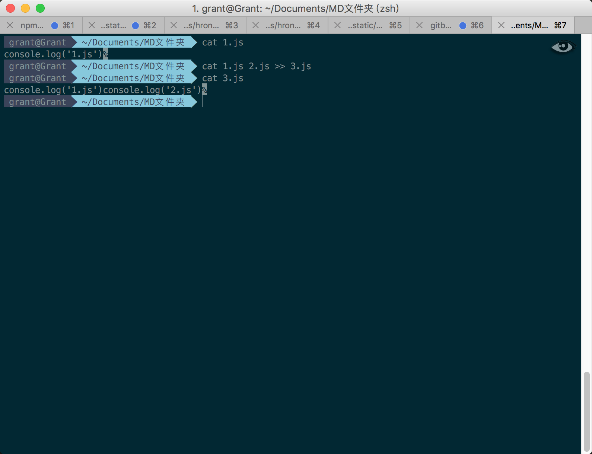
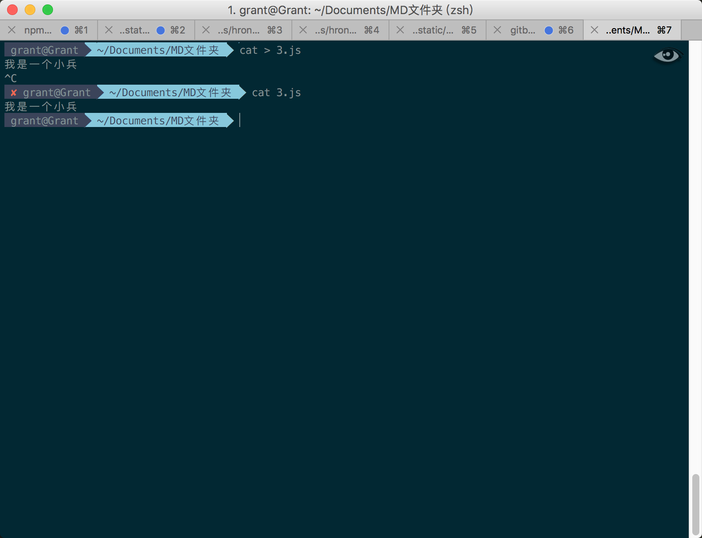
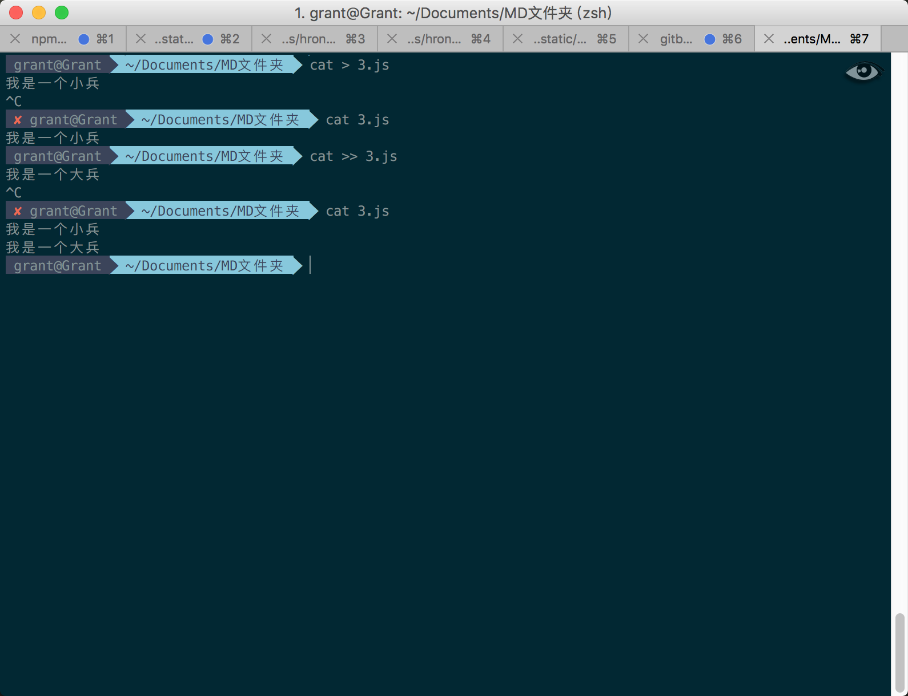
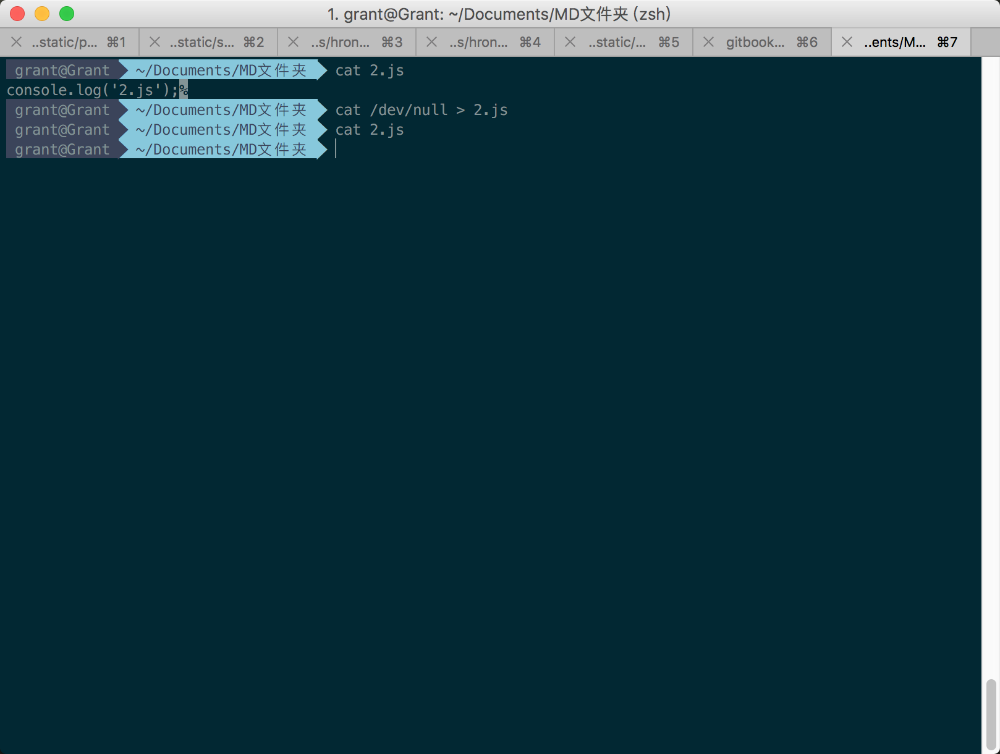

# cat命令

`cat`命令用于连接文件并打印到标准输出设备上。

## 把1.js文件内容显示到DOS窗口

```powershell
cat 1.js
cat -n 1.js # 显示行号，对于空白行编号
cat -b 1.js # 显示行号，对于空白行不编号
cat -s 1.js # 对于连续两行以上的空白行，替代为一行空白行
cat -e 1.js # 每行后面加上$显示
```



## 把1.js和2.js文件合并成3.js文件，如果已有此文件，则附加到该文件文档末尾

```powershell
cat 1.js 2.js >> 3.js
```



## 把1.js和2.js文件合并成3.js文件，如果已有此文件，则清空文件内容并写入

```powershell
cat 1.js 2.js > 3.js
```

## 新建3.js文件，如果3.js文件存在，则清空3.js文件内容

```powershell
cat > 3.js # 命令执行结束，进入编辑文件内容状态，如果不想编辑，按Ctrl+C直接退出编辑
```



## 向3.js文件追加内容

```powershell
cat >> 3.js # 命令执行结束，进入编辑文件内容状态，如果不想编辑，按Ctrl+C直接退出编辑
```



## 清空2.js文件内容

```powershell
cat /dev/null > 2.js
```

