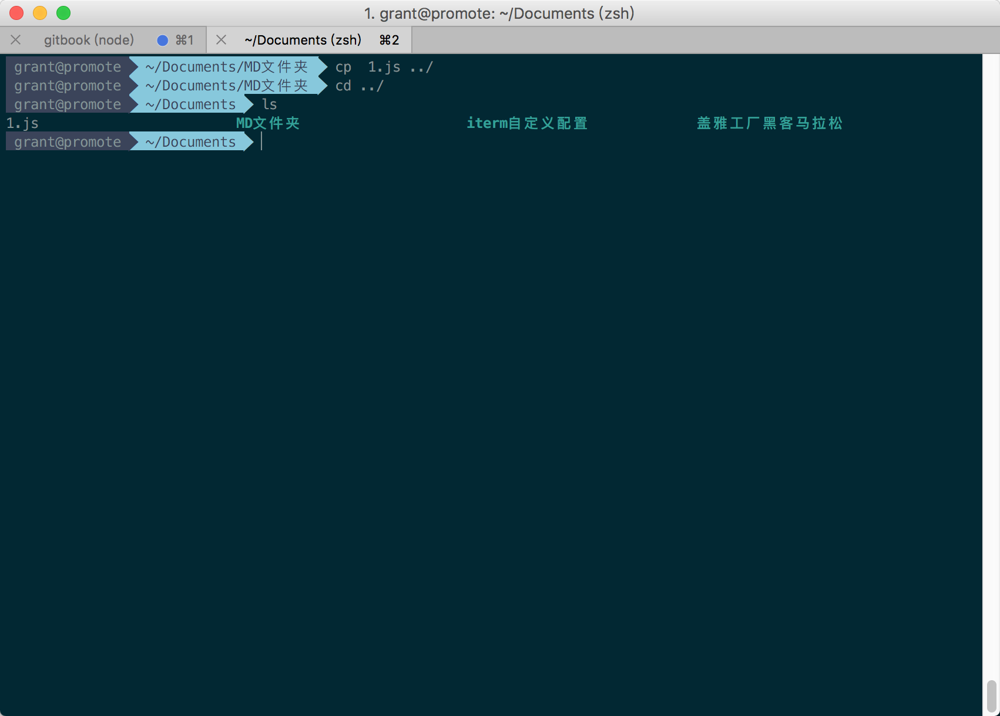
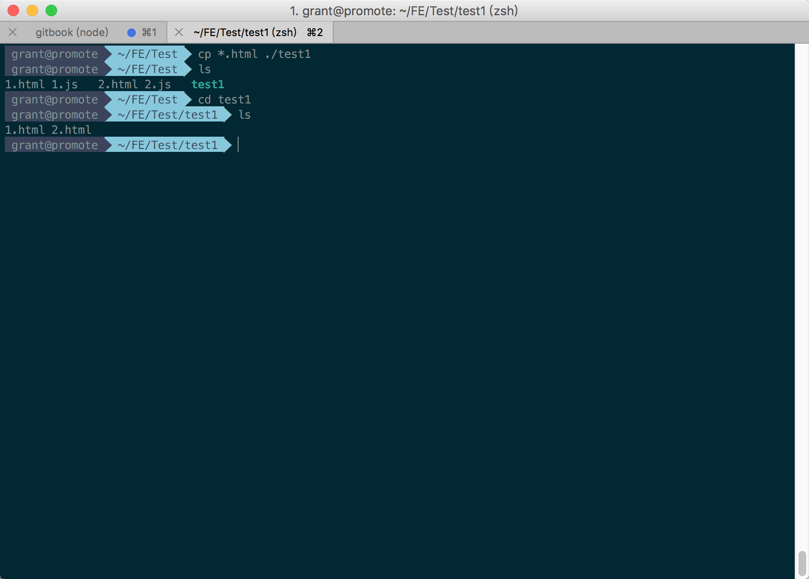
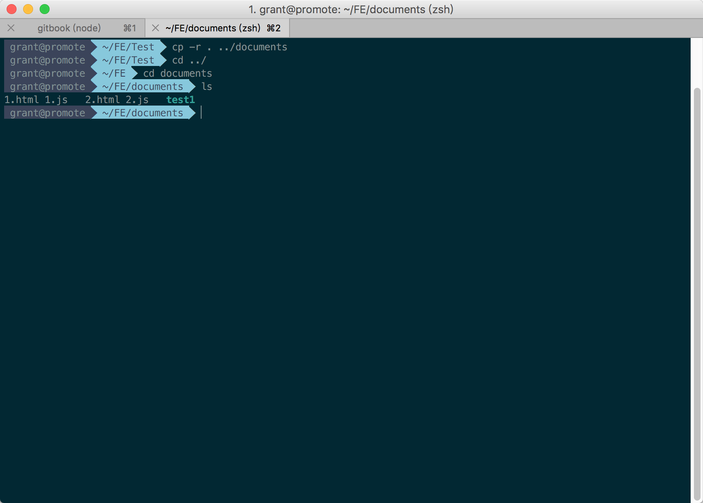

# cp命令

`cp`命令主要用于复制文件或目录。

## 把1.js文件复制到documents目录

```powershell
cp 1.js ../
```



## 把Test文件夹下所有后缀名为.html的文件复制到test1文件夹内

```powershell
cp *.html ./test1
```



## 把Test文件夹内所有文件及其及其子目录全部复制到documents文件夹内，如果documents文件夹不存在，则新建，再复制。

```powershell
cp -r . ../documents
```

